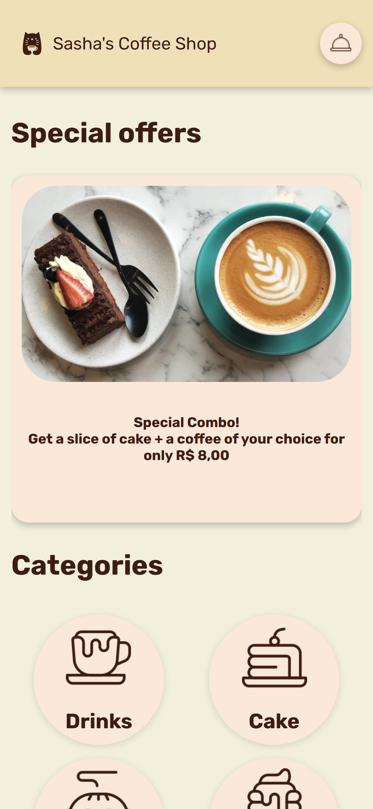
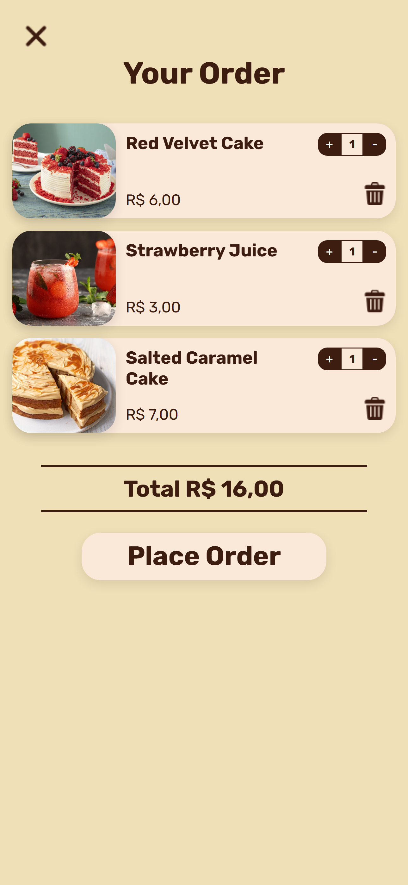

[REACT_BADGE]: https://img.shields.io/badge/react-%2320232a.svg?style=for-the-badge&logo=react&logoColor=%2361DAFB
[TYPESCRIPT_BADGE]: https://img.shields.io/badge/typescript-%23007ACC.svg?style=for-the-badge&logo=typescript&logoColor=white
[SASS_BADGE]: https://img.shields.io/badge/SASS-hotpink.svg?style=for-the-badge&logo=SASS&logoColor=white
[NPM_BADGE]: https://img.shields.io/badge/NPM-%23CB3837.svg?style=for-the-badge&logo=npm&logoColor=white
[VITE_BADGE]: https://img.shields.io/badge/vite-%23646CFF.svg?style=for-the-badge&logo=vite&logoColor=white

<h1 align="center" style="font-weight: bold;">Coffe Shop Order App ☕</h1>

<p align="center">
 <a href="#technologies">Technologies</a> • 
 <a href="#about">About</a> • 
 <a href="#requisites">Prerequisites</a> • 
 <a href="#started">Getting Started</a> 
</p>

<p align="center">
    <b>An application built with React, Typescript and SASS, that simulates making an order in a coffee shop. </b>
</p>

<h2 id="technologies">💻 Technologies</h2>

![react][REACT_BADGE]
![typescript][TYPESCRIPT_BADGE]
![sass][SASS_BADGE]
![vite][VITE_BADGE]
![npm][NPM_BADGE]

<h2 id="about">📌 About</h2>

<p>
  With this app, the customers of 'Sasha`s Coffee Shop', would be able to see the stablishment`s menu and place their order through their devices. 
</p>






<h2 id="requisites">📝 Prerequisites</h2>

- Node.js v22.11.0
- Git v2

<h2 id="started">🚀 Getting started</h2>

<h3>Cloning</h3>

```shell
git clone https://github.com/snportela/cafe-order-app
```

<h3>Installing dependencies</h3>

```shell
cd cafe-order-app
npm install
```

<h3>Starting</h3>

```shell
npm run dev
```
